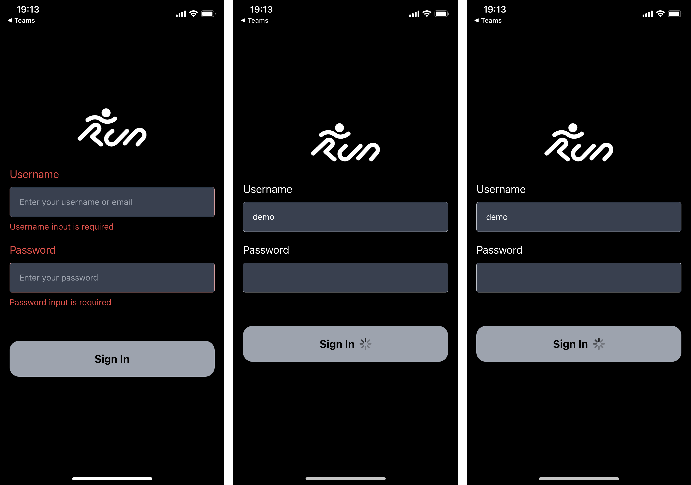
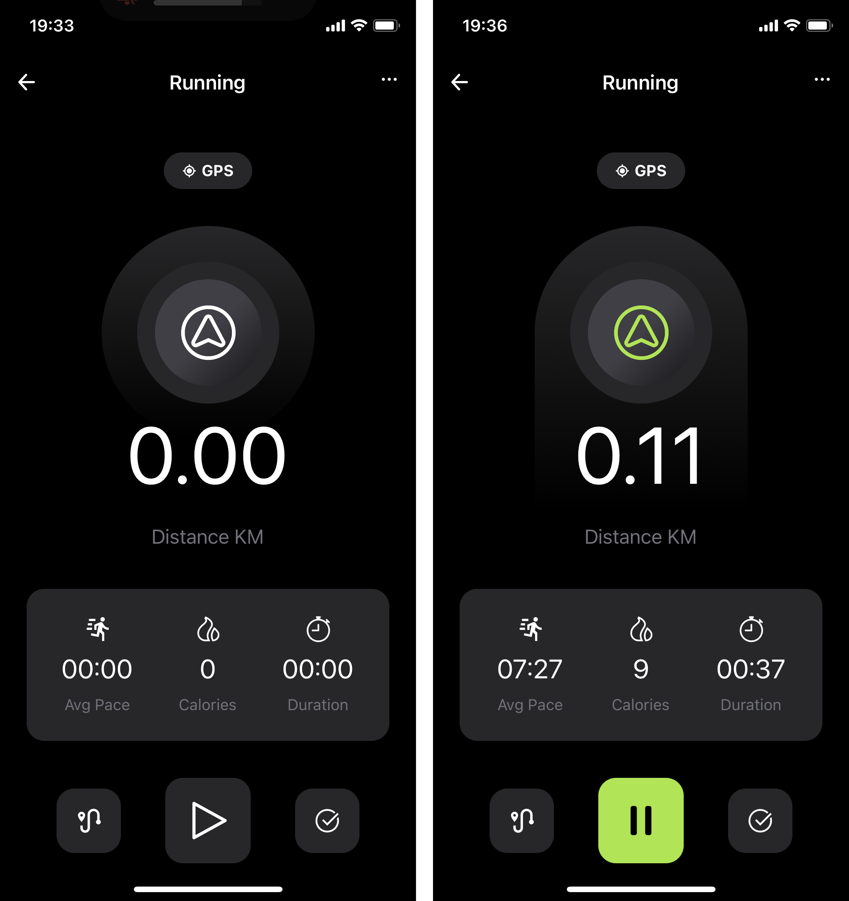

# 🏃‍ Running App 

Web and mobile app using [Expo](https://expo.dev/) and [NextJS](https://nextjs.org/)  
For routing [solito](https://solito.dev/) was used with [solito boilerplate](https://github.com/nandorojo/solito/tree/master/example-monorepos/blank) blank project

Web public: https://vercel-aaha.vercel.app  
Mobile public: https://expo.dev/@kloshar4o/running-app

### - Login Page
Mocked login form with simple `required` validation.

Additionally, route guard is added for hiding pages if not authorized.  

If user is trying to access guarded page, redirect to the login form will occur.   

After authorization, the user will be redirected to the requested page

### - Welcome Page
After logging in you will be presented with a welcome screen

### - Running Page
For stopwatch functionality [ts-stopwatch](https://github.com/UselessPickles/ts-stopwatch) is used  

Distance, burned calories and average pace is calculated on the client side.  

User can navigate back and forward between **welcome** and **running** pages,
without effecting the running script.  

User can reset the stop watch by clicking the ✅ check icon at the bottom right

## Development

- Install dependencies: `yarn`

- Next.js local dev: `yarn web`
  - Runs `yarn next`
- Expo local dev: `yarn native`
  - Runs `expo start`
